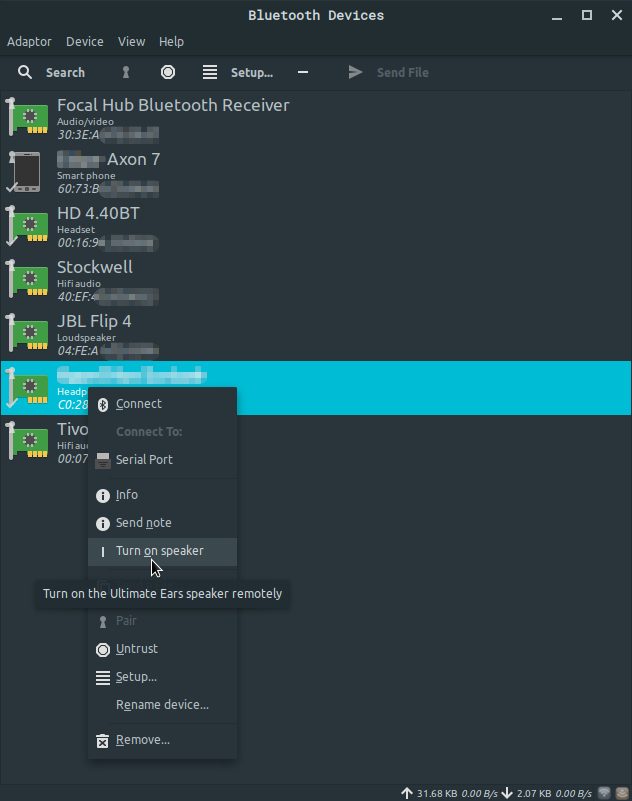

# Blueman plugin for [UE Boom Bluetooth speakers](https://www.ultimateears.com/)

[Blueman](https://github.com/blueman-project/blueman) is a very common bluetooth GUI for Linux. _Ultimate Ears_ Bluetooth speakers can be remotely "turned on" by sending a special packet. This plugin allows you to do exactly that from Blueman's UI. It uses the MAC address of known devices to guess if a device is likely to be a UE speaker and only displays the "turn on" button when that's the case.

## Installation

Inspect the contents of `install.sh` (there's one line to read 👻) and run it. If it doesn't work, then re-read the script and try to understand what it does concretely, it shouldn't be hard to adapt to your system.

Creating a deb file might be nice too.

## Problems

For some reason, on my PC, I can only turn the speaker on once per power cycle. After successfully powering the speaker on, I won't be able to send more packets until I reboot. Maybe there's a cache somewhere that I should clear, but I don't know precisely how the Bluex stack works and don't have the time to look into it.

## Acknowledgments

  * https://gist.github.com/marcust/af93ff47899583f5a52f for documenting how to turnn the speaker on
  * [Blueman](https://github.com/blueman-project/blueman)'s existing plugins' source code that I used as documentation
